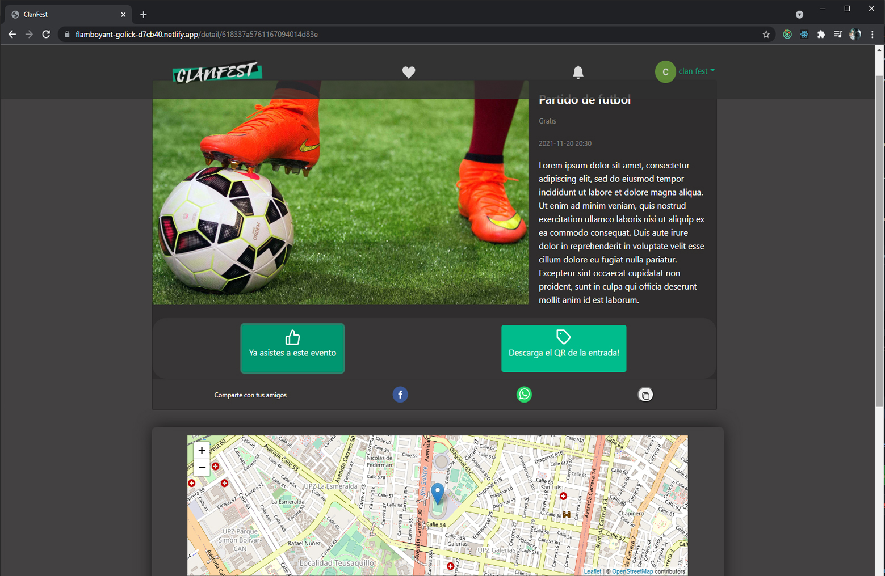
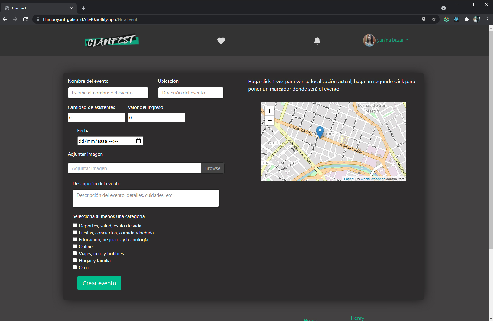
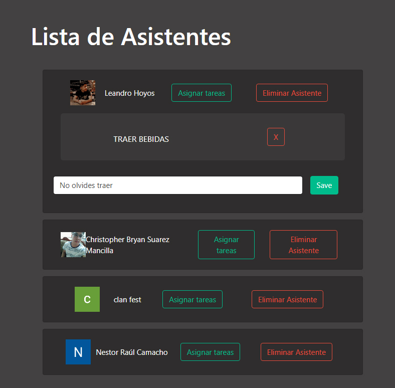
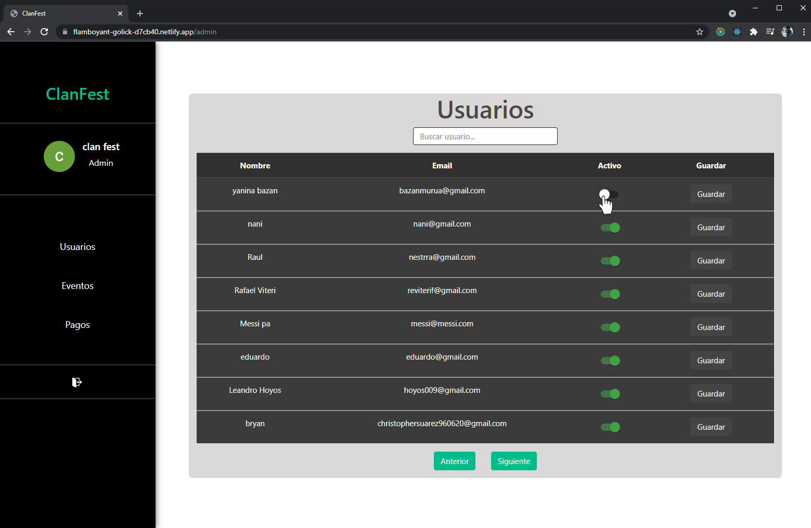

<a href="https://flamboyant-golick-d7cb40.netlify.app" target="blank"> <h2>CLAN FEST WEB APP</h2></a>

### Acerca de ClanFest

### App construida con
 - [ ] TypeScript
 - [ ] React
 - [ ] Redux
 - [ ] CSS3
 - [ ] Bootstrap

### Información
Este repositorio corresponde al frontend del proyecto CLANFEST.  
Repo del Backend del Proyecto: https://github.com/NaniBM/ClanFest-API

### Deploy en

  Netlify:  https://flamboyant-golick-d7cb40.netlify.app

### Instalacion
- Clonar repositorio: ``git clone https://github.com/christopherBryan1996/PF.git``
- Abrir proyecto en una terminal 
- Ejecutar ``npm install``
- En la carpeta ``src/components/constanteURL`` : seleccionar el valor de la constante URLrequest a:  
  - ``http://localhost:3008/`` si ya se instalo el repositorio de Backend para usarlo local
  - ``https://api-fest.herokuapp.com/`` para usar la API desde deploy

<h3> ¿Qué vas a encontrar en la web de ClanFest? </h3>

Visita la pagina, encuentra eventos cercanos a tu ubicación y agrega a favoritos.

  
 
 

 
Regístrate para acceder a todas las posibilidades que te brinda de CLANFEST
 

  

 
Revisa la categorías para encontrar eventos de tu interés
 

  

 
Añade y elimina eventos de tu lista de favoritos.
 

  

 
Compra la entrada a eventos con MercadoPago o confirma tu asistencia.
Recibirás un codigo QR como comprobante de entrada.
 

 
  

 
Crea eventos y administra los asistentes, podrás eliminarlos y dejarles tareas o recordatorios para el día del evento.
 

 
  
  

 
Si eres administrador de CLANFEST contarás con un panel, desde donde revisar y administrar usuarios, eventos creados y transacciones realizadas para controlar y regular la actividad de la aplicación.
 

 
  

