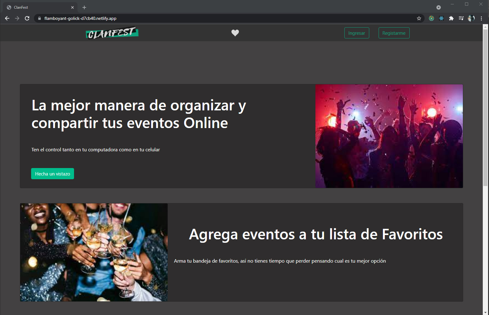
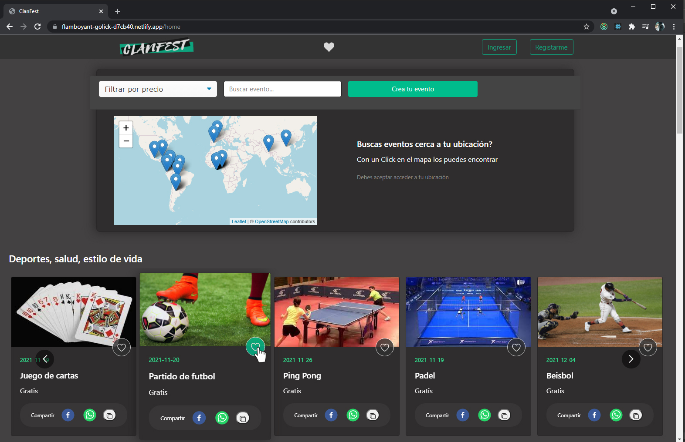
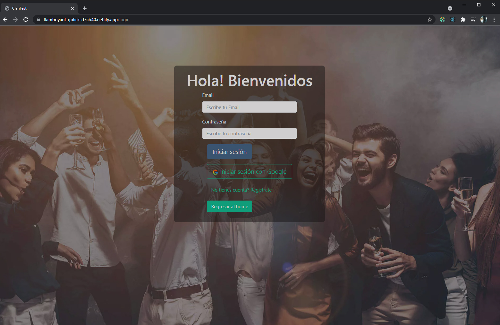
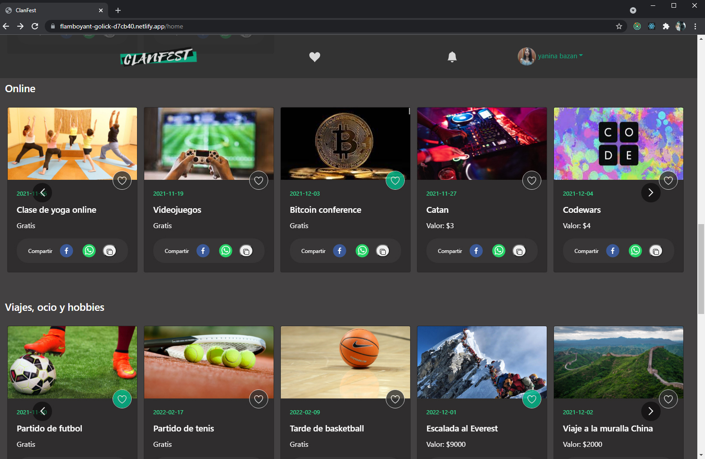
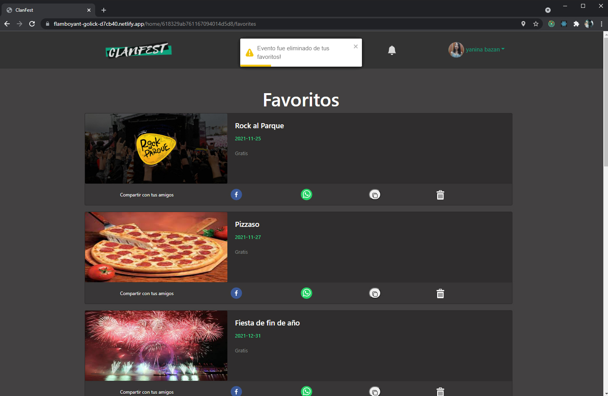

# CLAN FEST WEB APP FRONTEND

## ACERCA DE CLANFEST

### Construida con
 - [ ] TypeScript
 - [ ] React
 - [ ] Redux
 - [ ] CSS3
 - [ ] Bootstrap

### Información
Este repositorio corresponde al frontend del proyecto CLANFEST.  
Repo del Backend del Proyecto: https://github.com/NaniBM/ClanFest-API

### Deploy en

  Netlify:  https://flamboyant-golick-d7cb40.netlify.app/.com/

### Instalacion
- Clonar repositorio: ``git clone https://github.com/christopherBryan1996/PF.git``
- Abrir proyecto en una terminal 
- Ejecutar ``npm install``
- En la carpeta ``src/components/constanteURL`` : seleccionar el valor de la constante URLrequest a:  
  - ``http://localhost:3008/`` si ya se instalo el repositorio de Backend para usarlo local
  - ``https://api-fest.herokuapp.com/`` para usar la API desde deploy

<h3> ¿Qué vas a encontrar en la web de ClanFest? </h3>

Visitá la pagina, encontrá eventos cercanos a tu ubicación y agregá a favoritos.

  
 
 

 
Registrate para acceder a todas las posibilidades que te brinda de CLANFEST

  

 
Revisá la categorías para encontrar tus eventos de interés  

  

Añadí los eventos a favoritos para comprar la entrada o confirmar asistencia mas tarde.

  

Una vez que te decidís a asistir, compra la entrada con MercadoPago o confirma tu asistencia.
Recibirás un codigo QR como comprobante de entrada.

 
  

